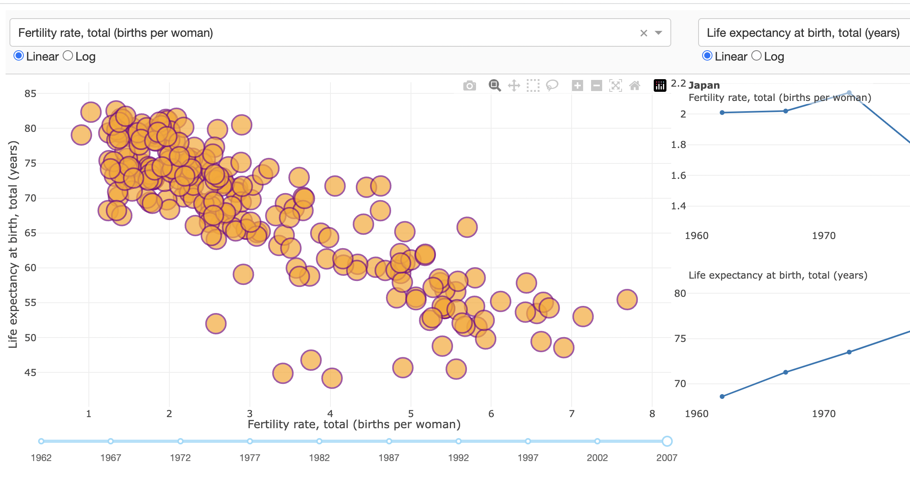
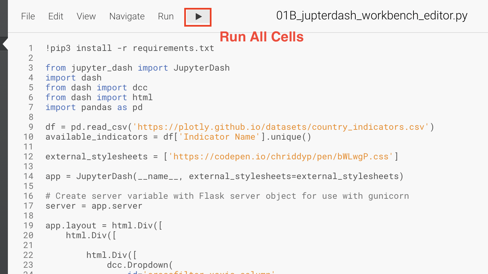
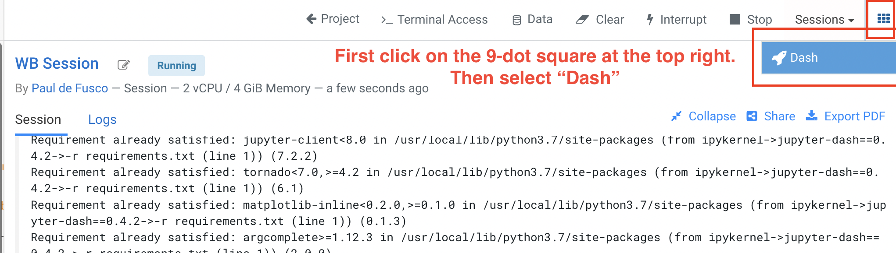
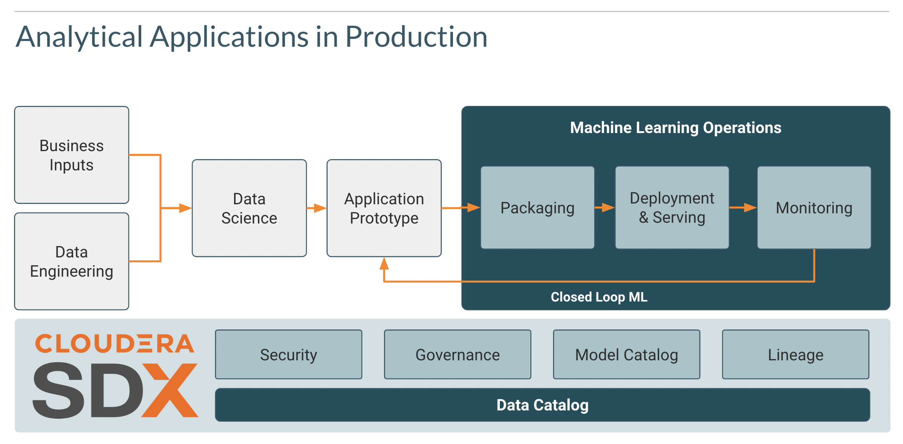

# Using JupyterDash in CML

## Objective

This GitHub Repository is a Quickstart for using JupyterDash in CML. JupyterDash is a new library by Plotly that makes it easy to build Dash apps from Jupyter environments (e.g. classic Notebook, JupyterLab, Visual Studio Code notebooks, nteract, PyCharm notebooks, etc.).

Dash is Plotly’s open source Python (and R and Julia!) framework for building full stack analytic web applications using pure Python (no JavaScript required). Thanks to features like hot reloading and front-end error reporting provided by Dash DevTools, developers can quickly iterate on application designs using a traditional text editor or Integrated Development Environment (IDE). JupyterDash makes these features, and more, available from the Jupyter notebook.

In this tutorial you will gain exposure to two JupyterDash use cases:

1. Notebook "1_jupyterdash_interactive": start a JupyterDash webserver in external mode and benefit from its Jupyter Notebook support capabilities. Python script "1B_jupyterdash_workbench_editor" achieves the same goal using the Workbench editor and is optional.

2. Notebook "2_jupyterdash_apiv2_cicd": more easily prototype and deploy your Dash Apps to Production as CML Analytic Applications.

## Requirements

A CML Workspace or CDSW Cluster with a Python 3.7+ Compatible Runtime or Engine.

* No code changes required.
* No CML Project Environment Variables need to be set.
* There is no requirement to load data into cloud storage.
* Python dependencies are installed in the first cell in notebook "1_jupyterdash_interactive.ipynb".
* Familiarity with Python, Dash and Jupyter Notebooks is recommended.

## Instructions

#### Notebook 1_jupyterdash_interactive

Launch a CML Session with the following minimum requirements:

```
Editor: JupyterLab
Kernel: Python 3.7 or above
Edition: Standard
Version: Any available verions
Enable Spark: not required
Resource Profile: Minimum 1 CPU / 2 GB Mem
```

More detailed instructions are available in the notebook. Run through each cell and simply follow along!




#### Python Script 1B_jupyterdash_workbench_editor (Optional)

Launch a CML Session with the following minimum requirements:

```
Editor: Workbench Editor
Kernel: Python 3.7 or above
Edition: Standard
Version: Any available verions
Enable Spark: not required
Resource Profile: Minimum 1 CPU / 2 GB Mem
```

Step 1: Open script "1B_jupyterdash_workbench_editor.py" and run all cells.



Step 2: When completed, open the Dash app by clicking on the nine-dot square at the top right of the screen.



#### Notebook 2_jupyterdash_prototyping_apps

Launch a CML Session with the following minimum requirements:

```
Editor: JupyterLab
Kernel: Python 3.7 or above
Edition: Standard
Version: Any available verions
Enable Spark: not required
Resource Profile: Minimum 1 CPU / 2 GB Mem
```

More detailed instructions are available in the notebook. Run through each cell and simply follow along!




## Next Steps

If you are using CML Analytic Applications you may also be interested in the following tutorials:

* [CSA2CML](https://github.com/pdefusco/CSA2CML): Build a real time anomaly detection dashboard with Flink, CML, and Streamlit.
* [SDX2CDE](https://github.com/pdefusco/SDX2CDE): Explore ML Governance and Security features in SDX to increase legal compliance and enhance ML Ops best practices. 
* [API v2](https://github.com/pdefusco/CML_AMP_APIv2): Familiarize yourself with API v2, CML's Python Library for ML Ops and DevOps.
* [Telco Churn Demo](https://github.com/pdefusco/CML_AMP_Churn_Prediction): Build an End to End ML Project in CML and Increase ML Explainability with the LIME Library
* [Learn how to use Cloudera Applied ML Prototypes](https://docs.cloudera.com/machine-learning/cloud/applied-ml-prototypes/topics/ml-amps-overview.html) to discover more projects using MLFlow, Streamlit, Tensorflow, PyTorch and many more popular libraries


## Conclusions

Cloudera Machine Learning (CML) is Cloudera’s cloud-native machine learning platform built for CDP. Cloudera Machine Learning unifies self-service data science and data engineering in a single, portable service as part of an enterprise data cloud for multi-function analytics on data anywhere.

It empowers organizations to build and deploy machine learning and AI capabilities for business at scale, efficiently and securely, anywhere they want. It’s built for the agility and power of cloud computing, but isn’t limited to any one cloud provider or data source.

* CML Analytic Applications give data scientists a way to create ML web applications/dashboards and easily share them with other business stakeholders. Applications can range from single visualizations embedded in reports, to rich dashboard solutions such as Tableau. They can be interactive or non-interactive.

* CML exposes a REST API that you can use to perform operations related to projects, jobs, and runs. You can use API commands to integrate CML with third-party workflow tools or to control CML from the command line.

If you have any questions about CML or would like to see a demo, please reach out to your Cloudera Account Team or send a message [through this portal](https://www.cloudera.com/contact-sales.html) and we will be in contact with you soon.
